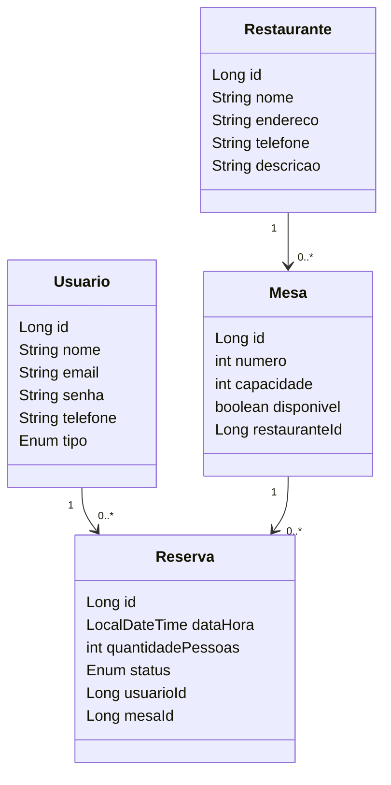
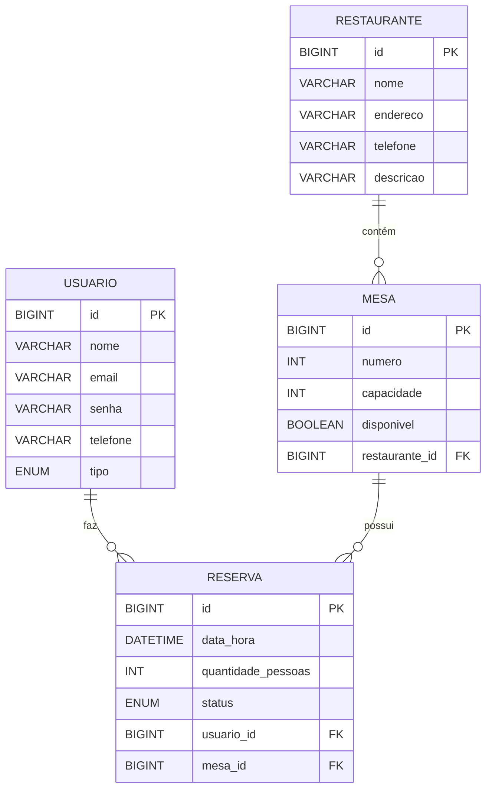
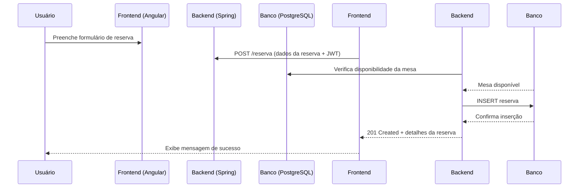

# 🧩 Sistema de Reserva De Restaurante

Este projeto é um sistema web completo com back-end em **Java (Spring)** e front-end em **Angular**, utilizando boas práticas de versionamento, documentação e integração contínua.

---

## 🚀 Tecnologias Utilizadas

### 🔙 Back-end

- ⚙️ **Java** — Linguagem principal
- 🌱 **Spring Framework** — Aplicação web (Spring Boot, Spring Security, etc.)
- 🐘 **PostgreSQL** — Banco de dados relacional
- 🔐 **JWT** — Autenticação baseada em token
- 📚 **Swagger** — Documentação da API
- 🧪 **Maven** — Gerenciamento de dependências
- ☁️ **Railway (opcional)** — Deploy na nuvem

### 🧾 Versionamento

- 🗂️ **Git & GitHub** — Controle de versão e colaboração

### 🗂️ Organização e Documentação

- 📌 **Trello** — Gestão de tarefas e prazos
- 📖 **Swagger** — Documentação interativa da API REST

# 🗂️ Estruturação de Pastas

📁 Módulos Principais
- 📦 controller/
Lida com as requisições HTTP (GET, POST, PUT, DELETE). Expõe os endpoints REST da aplicação.

- 🧱 model/
Contém as entidades do sistema, que representam tabelas no banco de dados.

- 🗃️ repository/
Interfaces que fazem a comunicação com o banco de dados. Usam JpaRepository para simplificar operações CRUD.

- 🧠 service/
Implementa a lógica de negócio. Os controllers chamam os serviços, que utilizam os repositórios.

- ⚙️ resources/application.properties
Arquivo de configurações do Spring Boot, como porta do servidor, conexão com o banco de dados, etc.

- 🖼️ resources/static/
Armazena arquivos estáticos como imagens, CSS e JS (caso a aplicação sirva front-end direto).

- 📝 resources/templates/
Templates HTML para motores como Thymeleaf, caso aplicável.

- 🧪 test/
Contém os testes automatizados da aplicação, organizados da mesma forma que o código principal.

- 📄 pom.xml
Arquivo de build e dependências do Maven.

- 📘 README.md
Documentação do projeto — você está lendo ele agora

## 🚀 Diagrama de Classes


## 🚀 Diagrama de relacionamento


## 🚀 Diagrama de Interação




---

## ✅ Roteiro de Testes: Cadastro de Reserva

Este roteiro descreve os testes unitários e de validação aplicados à funcionalidade de **cadastro de reservas** no sistema.

### 🧪 Objetivo

Garantir que todas as regras de negócio para o cadastro de reservas sejam devidamente validadas, prevenindo o envio de informações incompletas ou inválidas.

### 📋 Campos da Reserva

| Campo               | Obrigatório | Tipo/Validação                        |
|---------------------|-------------|-------------------------------------|
| `data`              | ✅ Sim      | Deve ser uma data válida no futuro  |
| `hora`              | ✅ Sim      | Formato de hora válido (ex: 18:30)  |
| `nome`              | ✅ Sim      | Texto não vazio                     |
| `telefone`          | ✅ Sim      | Formato numérico ou regex           |
| `observação`        | ❌ Não      | Texto livre (opcional)              |
| `número de pessoas` | ✅ Sim      | Número inteiro positivo             |
| `status`            | ✅ Sim      | Um dos: pendente, confirmado, cancelado, realizado |

---

### ✅ Casos de Teste de Validação (DTO/Entidade)

| ID   | Descrição do Teste                                                    | Resultado Esperado                      |
|------|----------------------------------------------------------------------|---------------------------------------|
| CT01 | Cadastro com todos os campos válidos                                  | Reserva criada com sucesso             |
| CT02 | Campo `data` vazio                                                     | Erro: "Data é obrigatória"             |
| CT03 | Campo `data` com data passada                                         | Erro: "Data deve ser no futuro"        |
| CT04 | Campo `hora` vazio                                                    | Erro: "Hora é obrigatória"             |
| CT05 | Campo `hora` com formato inválido (ex: 25:99)                         | Erro: "Formato de hora inválido"       |
| CT06 | Campo `nome` vazio                                                    | Erro: "Nome é obrigatório"             |
| CT07 | Campo `telefone` vazio                                                | Erro: "Telefone é obrigatório"         |
| CT08 | Campo `telefone` com caracteres inválidos                             | Erro: "Formato de telefone inválido"   |
| CT09 | Campo `número de pessoas` vazio ou zero                               | Erro: "Número de pessoas é obrigatório"|
| CT10 | Campo `número de pessoas` com valor negativo                          | Erro: "Número de pessoas inválido"     |
| CT11 | Campo `status` vazio                                                  | Erro: "Status é obrigatório"           |
| CT12 | Campo `status` com valor fora do permitido                            | Erro: "Status inválido"                |
| CT13 | Campo `observação` preenchido                                         | Reserva criada com sucesso             |
| CT14 | Campo `observação` deixado em branco                                  | Reserva criada com sucesso             |

---

### 🧪 Casos de Teste Unitário - Controller

| ID    | Descrição                                                            | Resultado Esperado                   |
|-------|----------------------------------------------------------------------|-----------------------------------|
| TC01  | Salvar reserva via POST com dados válidos                            | HTTP 200 com JSON da reserva salva|
| TC02  | Atualizar reserva existente via PUT                                  | HTTP 200 com JSON atualizado      |
| TC03  | Buscar reserva por ID válido via GET                                 | HTTP 200 com os dados esperados   |
| TC04  | Listar todas as reservas                                             | HTTP 200 com lista de reservas    |
| TC05  | Deletar reserva por ID válido via DELETE                             | HTTP 204 (sem conteúdo)           |

---

### 🧪 Casos de Teste Unitário - Service (Lógica)

| ID    | Descrição                                                            | Resultado Esperado                  |
|-------|----------------------------------------------------------------------|----------------------------------|
| TS01  | Salvar entidade no repositório                                       | Entidade salva corretamente      |
| TS02  | Atualizar entidade existente                                         | Campos atualizados corretamente  |
| TS03  | Deletar entidade por ID                                              | Entidade removida do repositório |

---

### 🧪 Casos de Teste Unitário - ServiceQuerry (Consulta)

| ID    | Descrição                                                            | Resultado Esperado              |
|-------|----------------------------------------------------------------------|-------------------------------|
| TQ01  | Buscar cliente por ID existente                                      | Cliente retornado com sucesso  |
| TQ02  | Buscar cliente por ID inexistente                                    | Lançamento de exceção          |
| TQ03  | Buscar lista de todos os clientes                                    | Lista retornada com sucesso    |

---

### 🧰 Tecnologias de Teste

- **Framework de Teste:** [JUnit 5](https://junit.org/junit5/)
- **Mocking:** [Mockito](https://site.mockito.org/)
- **Validação de Beans:** Hibernate Validator (`jakarta.validation`)
- **Cobertura de código (opcional):** Jacoco

---

### ▶️ Como Executar os Testes

1. Navegue até o diretório raiz do projeto
2. Execute:

```bash
mvn clean test
```

Ou Pelo Visual Studio Code

    Clique com o botão direito na pasta java ou no nome do projeto no Explorer e selecione "Run All Tests" ou "Run Tests in All Files".,
    Ou use o atalho: Ctrl+Shift+P e digite "Java: Run All Tests".

## ⚙️ Dependências e Build

- **Java 21** — Linguagem principal (`<java.version>21</java.version>`)
- **Spring Boot 3.4.5** — Framework principal (`starter-parent`)
- **Spring Data JPA** — Persistência de dados
- **Spring Web** — API REST
- **PostgreSQL** — Banco de dados relacional
- **Flyway** — Migração de banco de dados
- **MapStruct** — Mapeamento de DTOs
- **Lombok** — Redução de boilerplate
- **Springdoc OpenAPI** — Documentação Swagger
- **JUnit 5** — Testes automatizados

---

## 🧰 Como rodar o projeto

A API estará disponível em: [http://localhost:8080](http://localhost:8080)

---

## ❓ Suporte

Em caso de dúvida de como executar o projeto, entre em contato com:

📧 **caliel1023@yahoo.com**
