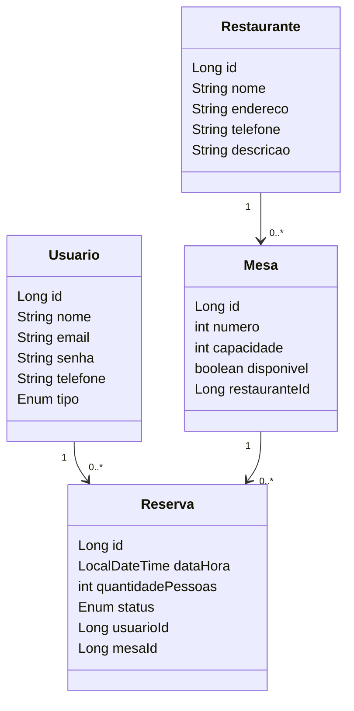
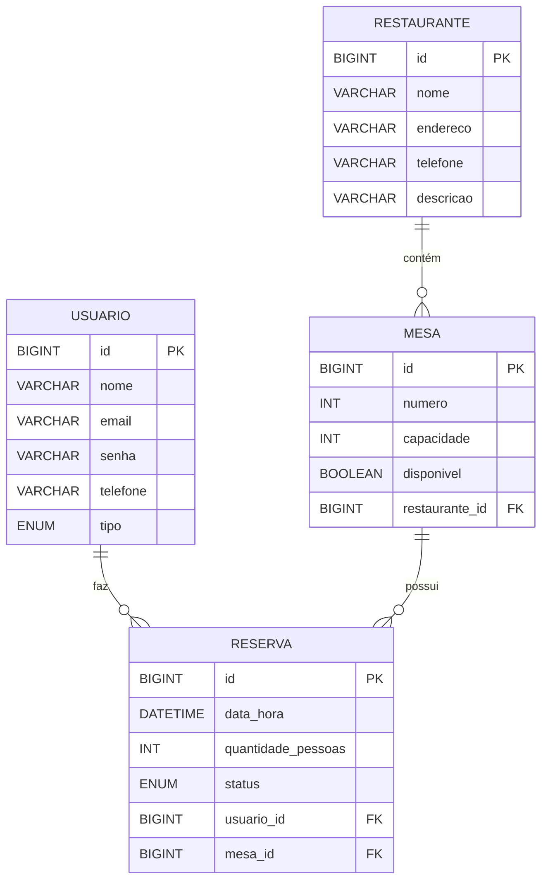
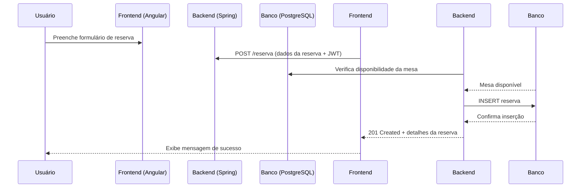

# 🧩 Sistema de Reserva De Restaurante

Este projeto é um sistema web completo com back-end em **Java (Spring)** e front-end em **Angular**, utilizando boas práticas de versionamento, documentação e integração contínua.

---

## 🚀 Tecnologias Utilizadas

### 🔙 Back-end

- ⚙️ **Java** — Linguagem principal
- 🌱 **Spring Framework** — Aplicação web (Spring Boot, Spring Security, etc.)
- 🐘 **PostgreSQL** — Banco de dados relacional
- 🔐 **JWT** — Autenticação baseada em token
- 📚 **Swagger** — Documentação da API
- 🧪 **Maven** — Gerenciamento de dependências
- ☁️ **Railway (opcional)** — Deploy na nuvem

### 🧾 Versionamento

- 🗂️ **Git & GitHub** — Controle de versão e colaboração

### 🗂️ Organização e Documentação

- 📌 **Trello** — Gestão de tarefas e prazos
- 📖 **Swagger** — Documentação interativa da API REST

# 🗂️ Estruturação de Pastas

📁 Módulos Principais
- 📦 controller/
Lida com as requisições HTTP (GET, POST, PUT, DELETE). Expõe os endpoints REST da aplicação.

- 🧱 model/
Contém as entidades do sistema, que representam tabelas no banco de dados.

- 🗃️ repository/
Interfaces que fazem a comunicação com o banco de dados. Usam JpaRepository para simplificar operações CRUD.

- 🧠 service/
Implementa a lógica de negócio. Os controllers chamam os serviços, que utilizam os repositórios.

- ⚙️ resources/application.properties
Arquivo de configurações do Spring Boot, como porta do servidor, conexão com o banco de dados, etc.

- 🖼️ resources/static/
Armazena arquivos estáticos como imagens, CSS e JS (caso a aplicação sirva front-end direto).

- 📝 resources/templates/
Templates HTML para motores como Thymeleaf, caso aplicável.

- 🧪 test/
Contém os testes automatizados da aplicação, organizados da mesma forma que o código principal.

- 📄 pom.xml
Arquivo de build e dependências do Maven.

- 📘 README.md
Documentação do projeto — você está lendo ele agora

## 🚀 Diagrama de Classes

## 🚀 Diagrama de relacionamento

## 🚀 Diagrama de Interação

---

